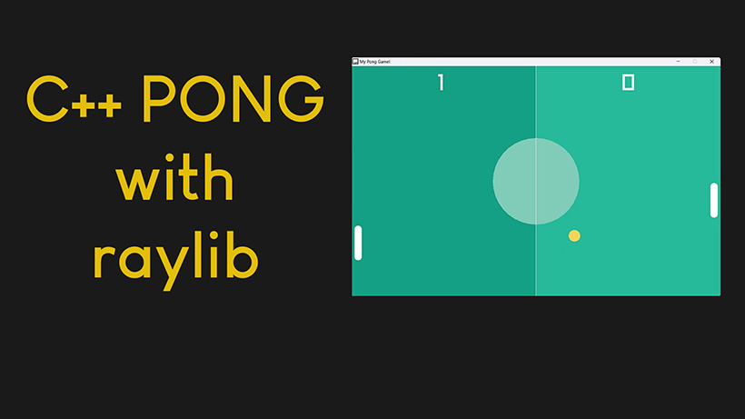

# Pong Game in C++ using Raylib library

Pong Game in C++ using Raylib library.

It works with raylib version 4.5.
Tested on both Windows 10 and Windows 11.

# Video Tutorial

  

🎥 <a href="https://youtu.be/VLJlTaFvHo4">Video Tutorial on YouTube</a>

 
 

| 📺 <a href="https://www.youtube.com/channel/UC3ivOTE5EgpmF2DHLBmWIWg">My YouTube Channel</a>
| 🌍 <a href="http://www.educ8s.tv">My Website</a> |  

